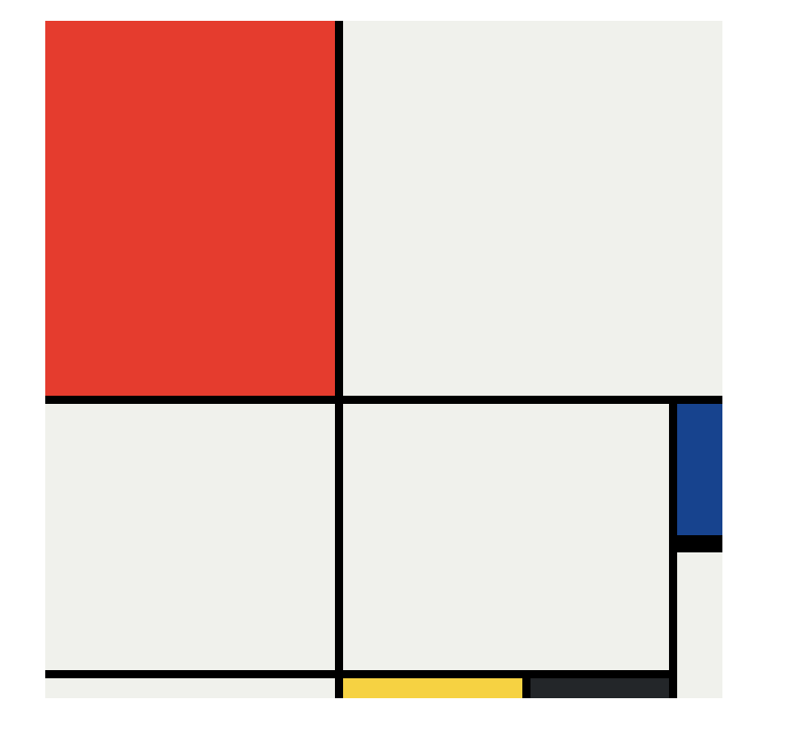

# Mondrian-style-grid-project-using-HTML-CSS-Grid
Basic Mondrian-style grid project using HTML &amp; CSS Grid, created during Dr. Angela Yu’s Complete 2023 Web Development Course.

 🔧 Technologies Used

- HTML5
- CSS3 (Grid Layout)

## 📸 Screenshot

## 📚 What I Learned

- How to use `grid-template-rows` and `grid-template-columns`
- Applying `grid-area`, `grid-column`, and `grid-row`
- Creating pixel-perfect layouts with CSS Grid
